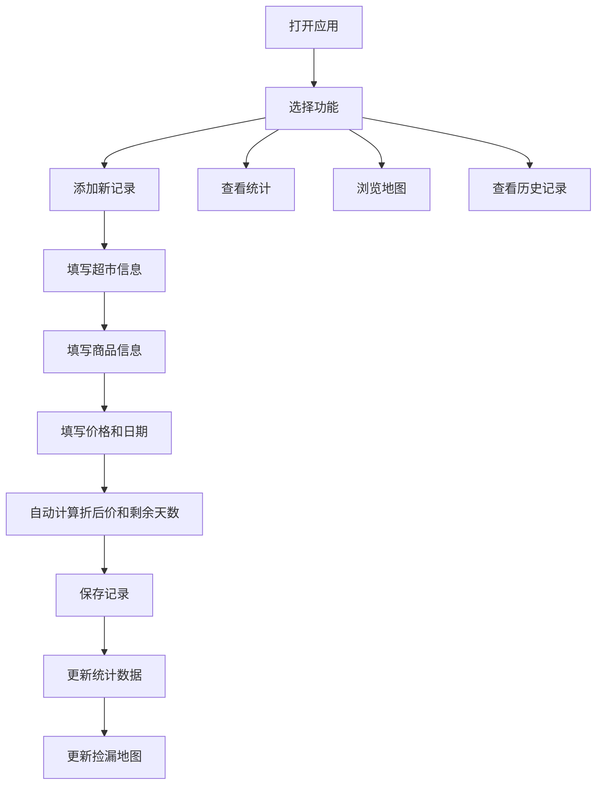

## 1. 产品概述

临期猎人捡漏日志是一款专为"临期食品爱好者"设计的个人记录工具。用户可以记录每次在超市发现的临期折扣商品，追踪捡漏战绩，并通过可视化地图探索自己的省钱版图。

- 核心价值：帮助临期食品爱好者系统化记录捡漏经历，发现省钱规律，打造专属的临期食品寻宝地图
- 目标用户：热爱淘临期食品的"临期猎人"、精打细算的消费者、喜欢探索超市角落的寻宝达人

## 2. 核心功能

### 2.1 用户角色

| 角色 | 注册方式 | 核心权限 |
|------|----------|----------|
| 临期猎人 | 无需注册，本地存储 | 记录捡漏、查看统计、浏览地图 |

### 2.2 功能模块

1. **记录中心**：添加/编辑捡漏记录，包含超市信息、货架位置、商品详情、价格折扣、过期时间
2. **战绩统计**：按超市、品类、时间维度统计捡漏次数、节省金额、折扣力度
3. **捡漏地图**：可视化展示各超市的捡漏分布，标注高频捡漏点
4. **记录列表**：浏览历史记录，支持筛选和搜索

### 2.3 页面详情

| 页面名称 | 模块名称 | 功能描述 |
|---------|----------|----------|
| 记录中心 | 表单录入 | 录入超市名称、货架位置、商品名称、品类、原价、折扣、过期日期、备注 |
| 记录中心 | 实时计算 | 自动计算折后价、节省金额、离过期天数 |
| 战绩统计 | 超市排行 | 按捡漏次数、节省金额对超市排名 |
| 战绩统计 | 品类分析 | 各品类捡漏次数、平均折扣分布 |
| 战绩统计 | 时间趋势 | 按月/周展示捡漏趋势 |
| 战绩统计 | 数据卡片 | 总捡漏次数、累计节省、平均折扣、最近捡漏 |
| 捡漏地图 | 超市分布 | 可视化展示所有超市位置及捡漏热度 |
| 捡漏地图 | 超市详情 | 点击查看该超市所有捡漏记录和统计 |
| 记录列表 | 卡片展示 | 以卡片形式展示所有捡漏记录 |
| 记录列表 | 筛选搜索 | 按超市、品类、日期范围筛选 |

## 3. 核心流程

## 4. 用户界面设计

### 4.1 设计风格

- **设计主题**：复古探险日志 / 藏宝图风格
- **主色调**：琥珀橙 (#D97706)、深棕色 (#78350F)、米黄纸色 (#FEF3C7)
- **辅助色**：森林绿 (#166534)、深红色 (#991B1B)、地图蓝 (#1E40AF)
- **字体**：
  - 标题：UnifrakturMaguntia / 具有复古哥特感的字体
  - 正文：Lora / 优雅的衬线字体，适合阅读
  - 数字：JetBrains Mono / 等宽字体，突出数据感
- **按钮风格**：圆角矩形，带有印章效果，hover时有微微抬起的3D感
- **布局风格**：卡片式布局，带有做旧纸张纹理和手绘边框
- **装饰元素**：藏宝图X标记、指南针、图钉、复古印章、胶带效果
- **背景**：米黄色纸张纹理，带有细微的做旧斑点

### 4.2 页面设计概览

| 页面名称 | 模块名称 | UI元素 |
|---------|----------|--------|
| 记录中心 | 表单录入 | 复古卷轴式表单，印章风格按钮，手绘边框输入框，自动计算动画 |
| 战绩统计 | 数据卡片 | 带有图钉装饰的卡片，徽章式数据展示，条形图和饼图 |
| 战绩统计 | 图表区域 | 手绘风格的柱状图和折线图，复古配色 |
| 捡漏地图 | 超市分布 | 牛皮纸地图背景，X标记超市位置，热度用颜色深浅表示 |
| 捡漏地图 | 交互效果 | 悬停显示超市信息，点击展开详情面板 |
| 记录列表 | 卡片展示 | 拍立得风格卡片，胶带装饰，日期印章 |

### 4.3 响应式设计

- **桌面端优先**：采用多列布局，充分利用大屏空间
- **移动端适配**：自动切换为单列布局，优化触摸交互
- **断点设计**：768px（平板）、480px（手机）

### 4.4 动效设计

- 页面加载：卷轴展开动画，印章落下效果
- 数据更新：数字滚动动画，徽章弹出效果
- 卡片交互：悬停时微微抬起，阴影加深
- 地图标记：脉冲动画提示热门捡漏点
