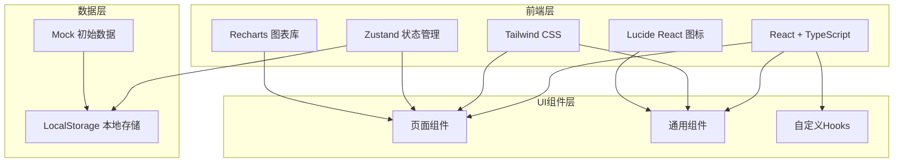
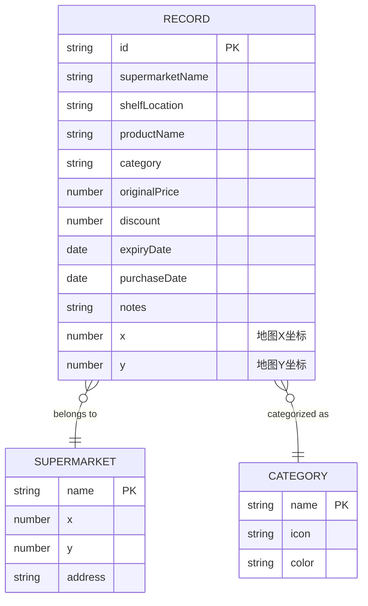

## 1. 架构设计



## 2. 技术选型

- **前端框架**：React@18 + TypeScript
- **构建工具**：Vite
- **样式方案**：Tailwind CSS@3
- **状态管理**：Zustand
- **图表库**：Recharts
- **图标库**：Lucide React
- **数据存储**：LocalStorage（纯前端，无需后端）
- **路由**：React Router DOM

## 3. 目录结构

```
src/
├── components/          # 通用组件
│   ├── Layout/         # 布局组件
│   ├── Card/           # 卡片组件
│   ├── Form/           # 表单组件
│   └── Chart/          # 图表组件
├── pages/              # 页面组件
│   ├── RecordPage/     # 记录中心
│   ├── StatsPage/      # 战绩统计
│   ├── MapPage/        # 捡漏地图
│   └── ListPage/       # 记录列表
├── store/              # 状态管理
│   └── useStore.ts
├── types/              # 类型定义
│   └── index.ts
├── utils/              # 工具函数
│   ├── calculations.ts # 计算函数
│   └── mockData.ts     # Mock数据
├── hooks/              # 自定义Hooks
├── App.tsx
├── main.tsx
└── index.css
```

## 4. 路由定义

| 路由 | 页面 | 说明 |
|------|------|------|
| `/` | 记录中心 | 添加新的捡漏记录 |
| `/stats` | 战绩统计 | 查看统计分析 |
| `/map` | 捡漏地图 | 可视化超市分布 |
| `/list` | 记录列表 | 浏览历史记录 |

## 5. 数据模型

### 5.1 实体关系图



### 5.2 类型定义

```typescript
export interface Record {
  id: string;
  supermarketName: string;
  shelfLocation: string;
  productName: string;
  category: string;
  originalPrice: number;
  discount: number;
  expiryDate: string;
  purchaseDate: string;
  notes: string;
  x: number;
  y: number;
}

export interface Supermarket {
  name: string;
  x: number;
  y: number;
  address: string;
  recordCount: number;
  totalSavings: number;
}

export interface Category {
  name: string;
  icon: string;
  color: string;
}

export interface StatsData {
  totalRecords: number;
  totalSavings: number;
  averageDiscount: number;
  latestRecord: Record | null;
  bySupermarket: SupermarketStat[];
  byCategory: CategoryStat[];
  byMonth: MonthStat[];
}

export interface SupermarketStat {
  name: string;
  count: number;
  totalSavings: number;
  averageDiscount: number;
}

export interface CategoryStat {
  name: string;
  count: number;
  totalSavings: number;
  averageDiscount: number;
}

export interface MonthStat {
  month: string;
  count: number;
  totalSavings: number;
}
```

### 5.3 初始Mock数据

内置超市列表（含预设坐标）：
- 沃尔玛、永辉超市、盒马鲜生、家乐福、大润发、Ole'精品超市、7-11、全家、罗森

内置品类列表：
- 零食饮料、奶制品、冷冻食品、粮油调味、肉蛋生鲜、烘焙甜品、酒水、日用百货
